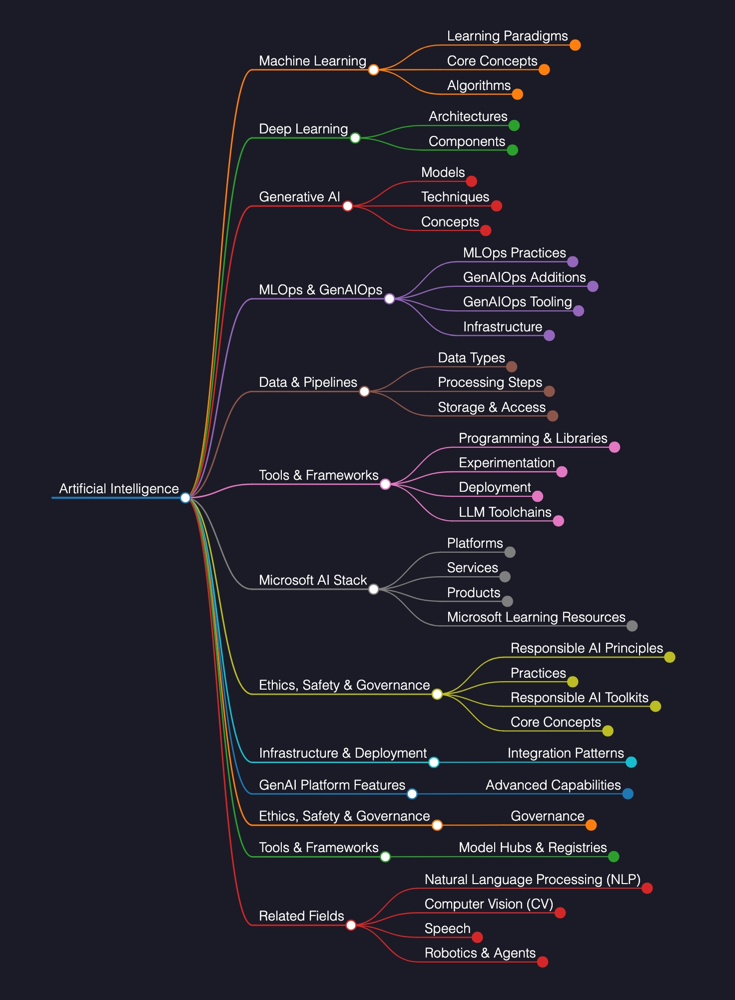
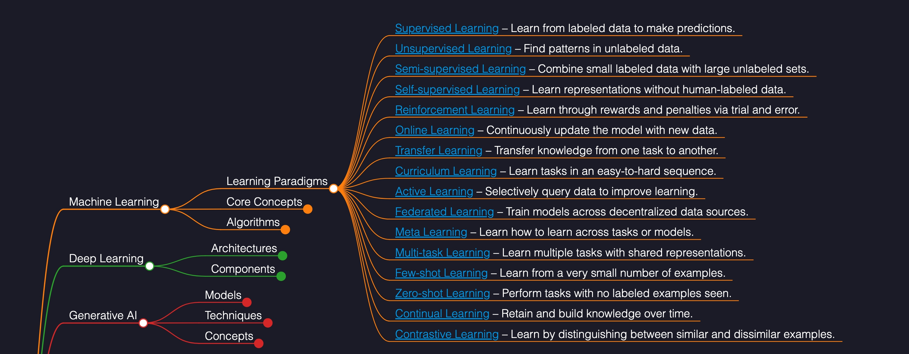

# 🧠 Dan’s AI Terminology Tracker
> 🚧 **This project is a work in progress** – contributions are welcome!  
> Found a broken link, missing concept, or new Microsoft AI tool? Open an issue or pull request.

Welcome to **Dan’s AI Terminology Tracker** - an open, visual, and structured reference map of key concepts, terms, and technologies in Artificial Intelligence and Machine Learning.

This resource is built using [**Markmap**](https://markmap.js.org/), a JavaScript-powered tool that turns Markdown lists into **interactive mind maps**. The result is a dynamic, explorable way to understand and organize terminology across a broad AI landscape - from foundational learning paradigms to Microsoft-specific AI services.

<a href="https://ai-terms.daniel.mcloughlin.cloud/" target="_blank">
  
</a>

---

## 🎯 About This Project

As I continue my own journey studying AI, I’ve created this tracker to:
- Serve as a **living reference point**
- Support my ongoing content series on **Azure AI Foundry**
- Help others in the **AI, ML, and Microsoft Azure communities** navigate terminology more easily

📘 View my Azure AI Foundry content series here: [daniel.mcloughlin.cloud/series/azureai](https://daniel.mcloughlin.cloud/series/azureai)


### Screenshots
<p align="center">
  
</p>
<p align="center">
  
</p>

## ✅ Section Progress Tracker

| Section                     | Status     | Notes                                  |
|-----------------------------|------------|----------------------------------------|
| Core Concepts (ML)          | ✅ Complete | Definitions and links added            |
| Learning Paradigms          | ✅ Complete | Fully populated with links             |
| Algorithms                  | ⬜ To Do    | Placeholder terms only                 |
| Architectures (Deep Learning)| ⬜ To Do   | Placeholder terms only                 |
| Components (DL)             | ⬜ To Do    | Needs definitions and sources          |
| Generative AI - Models      | ⬜ To Do    | Terms listed, needs enrichment         |
| Generative AI - Techniques  | ⬜ To Do    | Terms listed, needs enrichment         |
| Generative AI - Concepts    | ⬜ To Do    | Terms listed, needs enrichment         |
| MLOps Practices             | ⬜ To Do    | Terms listed, needs context + links    |
| GenAIOps Additions          | ⬜ To Do    | Terms listed, needs context + links    |
| GenAIOps Tooling            | ✅ Complete | Links + descriptions populated         |
| Data & Pipelines            | ⬜ To Do    | Terms listed, no descriptions yet      |
| Microsoft AI Stack          | ✅ Complete | Fully linked and structured            |
| Ethics, Safety & Governance | ✅ Partial | Needs some definition/links cleanup    |
| GenAI Platform Features     | ✅ Complete | Responses API, PTU, Spillover done     |
| Infrastructure & Deployment | ✅ Complete | Sidecar and landing zone added         |
| Tools & Frameworks          | ⬜ To Do    | Tools listed, but not described        |
| Related Fields (NLP, CV, Speech) | ⬜ To Do | Terms listed, no descriptions yet     |

---

## 🧠 What You'll Find

This terminology tracker includes:
- Core concepts in AI, ML, and Deep Learning
- Generative AI topics like LLMs, Prompt Engineering, and RAG
- MLOps & GenAIOps terms and processes
- Data pipelines, model lifecycles, and infrastructure
- Microsoft-centric AI tools and services from Azure AI
- Related domains including NLP, CV, and Speech
- Ethics, safety, and responsible AI considerations

> **Note:** This tracker currently has a **Microsoft slant** — it reflects the language and concepts I encounter via **Microsoft Learn** and **Azure AI Services**. Feel free to contribute if you'd like to see other sections.

---

## 📈 Visual Format

All terminology is structured in a Markdown file, which is rendered visually using **Markmap**.

You can:
- View it interactively in the browser
- Navigate through the hierarchy
- Expand/collapse terms as needed

---

## 🤝 Community Contributions

Feel free to:
- Suggest new terms or definitions
- Submit pull requests for corrections or additions
- Help grow the visual map

---

## 🪪 License

This project is licensed under the **MIT License** — you're free to use, share, remix, and build upon it, as long as attribution is given.

---

## 🛠 How It's Built

This project uses [Markmap](https://markmap.js.org) to convert a Markdown list into an interactive mind map.  
After exporting the map, a custom **post-processing script** applies visual enhancements including:

- Dark mode theme
- Custom font and header
- White text and dark background for readability
- A favicon
- Branding and blog link

---

## ⚙️ Setup Instructions

Install the Markmap CLI (if not already installed):

```bash
npm install -g markmap-cli
```

Then run this command from the root of the repo:

```bash
npx markmap-cli markmap.md -o ./docs/index.html --no-open && node postprocess-map.js
```

This generates the visual map and applies styling in one go.

---

## 🔗 Link Checker

This project includes a `check-links.js` script that scans all external links in `markmap.md` to:

- Identify broken or redirected URLs
- Report any issues in a dedicated `broken-links.log` file
- Help maintain high-quality, up-to-date reference links for learners

### ✅ Why this exists:
Because this tracker is intended to be long-lived and reliable, it's important to regularly check that:
- All links point to official and active sources (e.g., Microsoft Learn, Wikipedia, GitHub)
- There are no outdated, redirected, or dead references in the mind map

### ▶️ How to run it:

```bash
node check-links.js
```

This will:
- Output results to the terminal (with ✅ and ❌ indicators)
- Write any issues to `broken-links.log` for review
- Automatically clear the log if no issues are found

```

---

## 🌐 Why the `/docs` Folder?

The `docs` folder is used because GitHub Pages has been configured to serve static content from it.  
The `index.html` is published at:

📍 `https://clouddevdan.github.io/dans-ai-terminology-tracker/index.html`